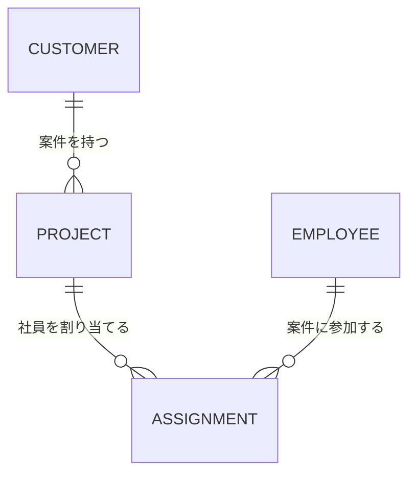

# Java Business Management System

Javaを使用して開発する、業務システムを想定したWebアプリケーションです。

単純なCRUDアプリケーションの作成を目的とせず、実務で扱うことを想定して、**要件整理・設計・データベース設計・API・業務ロジック・バリデーション・認証・テスト・エラー処理・保守性**までを意識して開発します。

また、これまでの実務で経験した業務システム開発をベースに、Javaを使った場合にどのような設計・実装になるのかを自分自身で理解することを目的としています。

---

## プロジェクト概要
### プロジェクト名
**Java Business Management System**

### 概要
顧客・案件・社員などの情報を管理し、案件に対する社員のアサイン状況などを確認できる業務管理システムです。
想定する利用者は、企業内で顧客・案件・社員を管理する担当者です。
主な機能として、以下を実装します。

* ログイン
* ユーザー管理
* 顧客管理
* 案件管理
* 社員管理
* 案件への社員アサイン
* 検索・絞り込み
* 登録・編集・削除
* 入力値バリデーション
* エラー処理
* CSV入出力
* 操作ログ
* テスト

---

# このポートフォリオを作る目的

このプロジェクトの最大の目的は、**Javaを使った実務的なWebアプリケーション開発を一通り経験すること**です。

特に以下を身につけることを重視します。

### Javaそのものの理解

* Javaの基本文法
* クラス
* インターフェース
* 継承
* カプセル化
* コレクション
* Stream API
* Optional
* 例外処理
* Enum
* DTO
* Javaでのオブジェクト指向設計

単に文法を覚えるのではなく、実際のアプリケーションの中でどのように使われるのかを理解します。

### Webアプリケーション開発

* HTTP
* REST API
* リクエスト・レスポンス
* HTTPステータスコード
* Controller
* Service
* Repository
* DTO
* Entity
* バリデーション
* エラー処理

### データベース

* テーブル設計
* 主キー・外部キー
* リレーション
* SQL
* CRUD
* JOIN
* トランザクション
* インデックス
* データ整合性

### 開発品質

* 単体テスト
* 結合テスト
* APIテスト
* エラーケース
* 入力値チェック
* 可読性
* 保守性

---

# なぜ「業務管理システム」を作るのか

このプロジェクトでは、**実際の企業で利用されることを想定した業務システム**を題材にします。

理由は、業務システムには以下のような要素が含まれるためです。

```text
ユーザー
  ↓
画面
  ↓
API
  ↓
Controller
  ↓
Service
  ↓
Repository
  ↓
Database
```

さらに、

```text
入力チェック
データ整合性
権限
エラー処理
ログ
テスト
```

など、実務で必要になる要素を経験できます。

---

# 現時点で使用する技術

現時点で以下の技術を使用することを確定します。

| 分類           | 技術              |
| ------------ | --------------- |
| 言語           | Java            |
| Webフレームワーク   | Spring Boot     |
| ビルドツール       | Maven           |
| データベース       | PostgreSQL      |
| ORM / DBアクセス | Spring Data JPA |
| API          | REST API        |
| テスト          | JUnit           |
| バージョン管理      | Git / GitHub    |
| 開発環境         | VSCode  |
| API確認        | Postman         |

※ フロントエンドについては、Javaによるバックエンド開発を主目的とするため、現時点では最小限の構成とします。

※ 新しい技術を増やすこと自体を目的とせず、まずは上記技術を使って一通りのWebアプリケーションを完成させることを優先します。

---

# システムで管理するデータ

主要なデータは以下とします。

```text
User
Customer
Project
Employee
Assignment
```

## User

システムを利用するユーザー。

```text
id
username
password
role
created_at
updated_at
```

---

## Customer

取引先・顧客の情報。

```text
id
name
contact_name
email
phone
address
status
created_at
updated_at
```

---

## Project

顧客から受けている案件。

```text
id
customer_id
name
description
start_date
end_date
status
created_at
updated_at
```

---

## Employee

社内の社員情報。

```text
id
name
email
department
position
status
created_at
updated_at
```

---

## Assignment

案件と社員の関係を管理するデータ。

```text
id
project_id
employee_id
role
start_date
end_date
created_at
updated_at
```

---

# データの関係

基本的な関係は以下とします。

```text
Customer
   │
   │ 1:N
   ▼
Project
   │
   │ 1:N
   ▼
Assignment
   ▲
   │ N:1
   │
Employee
```

つまり、

* 1つの顧客が複数の案件を持つ
* 1つの案件に複数の社員をアサインできる
* 1人の社員が複数の案件にアサインできる

という構造です。

この関係を通して、単純な1テーブルだけではなく、**複数テーブルを扱う業務システム**を経験します。

---

# 実装する主要機能

## 1. ログイン

システム利用者がログインできるようにします。

目的：

* 認証の基本を理解する
* セキュリティを意識する
* ユーザー情報と権限を扱う

---

## 2. 顧客管理

顧客情報について以下を行えるようにします。

* 一覧表示
* 詳細表示
* 新規登録
* 編集
* 削除
* 検索
* ステータス変更

---

## 3. 案件管理

案件について以下を行えるようにします。

* 一覧表示
* 詳細表示
* 新規登録
* 編集
* 削除
* 顧客との紐付け
* ステータス管理
* 期間管理
* 検索

---

## 4. 社員管理

社員情報について以下を行えるようにします。

* 一覧表示
* 詳細表示
* 新規登録
* 編集
* 削除
* 所属管理
* ステータス管理
* 検索

---

## 5. 案件アサイン管理

案件と社員を紐付けます。

例えば、

```text
案件A

担当PM
  └─ 山田

開発
  ├─ 佐藤
  └─ 鈴木
```

のような状態を管理します。

実装を通して、

* 多対多の関係
* 中間テーブル
* 複数テーブルのJOIN
* 業務ルール

を理解します。

---

# CSV機能

CSVを利用したデータの入出力を実装します。

対象はまず顧客・社員などのマスターデータとします。

### CSVインポート

```text
CSV
 ↓
読み込み
 ↓
形式チェック
 ↓
データチェック
 ↓
登録
```

### CSVエクスポート

```text
Database
 ↓
データ取得
 ↓
CSV生成
 ↓
ダウンロード
```

これまで経験したCSV処理をJavaで再実装することで、**実務経験とJava学習を接続する**ことを目的とします。

---

# バリデーション

ユーザーが入力した値をそのままDBに保存しないようにします。

例えば、

* 必須チェック
* 文字数
* メールアドレス形式
* 日付形式
* 数値
* 不正なID
* 重複データ

などをチェックします。

単純に「エラーを出す」だけではなく、

> 「なぜこの値を許可しないのか」

という業務ルールも意識します。

---
# テスト
これまでの実務ではテスト経験が十分ではなかったため、このプロジェクトでは意識的にテストを経験します。

### 単体テスト

主にServiceなどの業務ロジックを対象とします。

```text
正常系
異常系
境界値
```

を確認します。

### APIテスト

Controller / APIについて、

```text
正常なリクエスト
不正なリクエスト
存在しないID
認証エラー
権限エラー
```

などを確認します。

---

# ディレクトリ構成

基本構成は以下とします。

```text
java-business-management-system/
│
├── README.md
├── pom.xml
├── .gitignore
│
├── docs/
│   ├── requirements.md
│   ├── design.md
│   ├── database.md
│   ├── api.md
│   └── test-plan.md
│
└── src/
    ├── main/
    │   ├── java/
    │   │   └── com/example/businessmanagement/
    │   │       │
    │   │       ├── controller/
    │   │       ├── service/
    │   │       ├── repository/
    │   │       ├── entity/
    │   │       ├── dto/
    │   │       ├── exception/
    │   │       ├── config/
    │   │       └── BusinessManagementApplication.java
    │   │
    │   └── resources/
    │       ├── application.yml
    │       └── db/
    │
    └── test/
        └── java/
            └── com/example/businessmanagement/
                ├── controller/
                ├── service/
                └── repository/
```

---

# 各ディレクトリの責務

## controller/

HTTPリクエストを受け取る場所。

担当する処理：

* リクエスト受付
* DTOへの変換
* Service呼び出し
* HTTPレスポンス生成

Controllerに業務ロジックを集中させない。

---

## service/

業務ロジックを担当。

例えば、

```text
案件登録
案件のステータス変更
社員アサイン
顧客との関連チェック
```

などを担当します。

---

## repository/

DBへのアクセスを担当。

Serviceから直接SQLやDB操作を行わず、Repositoryに責務を分離します。

---

## entity/

DBのテーブルと対応するEntityを管理します。

---

## dto/

APIのリクエスト・レスポンスで利用するデータ構造を管理します。

EntityをそのままAPIレスポンスとして利用することを避け、**DBの構造とAPIの構造を分離する**ことを意識します。

---

## exception/

アプリケーションで発生する例外を管理します。

例えば、

```text
ResourceNotFoundException
BusinessException
```

など。

---

## config/

アプリケーション全体の設定を管理します。

---

# 開発順序
以下の順番で段階的に開発します。

```text
1. Java / Spring Bootプロジェクト作成
        ↓
2. PostgreSQL接続
        ↓
3. Entity / Repository
        ↓
4. 顧客CRUD
        ↓
5. 案件CRUD
        ↓
6. 社員CRUD
        ↓
7. 案件・社員アサイン
        ↓
8. バリデーション
        ↓
9. エラー処理
        ↓
10. 認証・認可
        ↓
11. CSV
        ↓
12. ログ
        ↓
13. テスト
        ↓
14. README / 設計資料整理
```

まず小さく動かし、その後に機能を追加します。

---

# 開発時に重視すること

## 「動けばいい」で終わらせない

以下を常に意識します。

```text
動作するか
↓
読みやすいか
↓
責務が分離されているか
↓
変更しやすいか
↓
テストできるか
```

---

## 1つのクラスに処理を集中させない

例えばControllerに、

```text
入力チェック
DBアクセス
業務判断
データ加工
レスポンス生成
```

をすべて書かない。

それぞれの責務を適切なクラスへ分離します。

---

## 実装理由を残す

重要な設計判断については、

> なぜこの構造にしたのか

を説明できるようにします。

単に「こう書いた」ではなく、

> 「この処理をServiceに置いた理由」

> 「EntityとDTOを分けた理由」

> 「このテーブル構造にした理由」

などを説明できる状態を目指します。

---

# このポートフォリオで最終的に説明できるようにすること

完成後、以下について自分の言葉で説明できる状態を目標とします。

### Java

* Javaをなぜこのように書いたのか
* クラス・インターフェースをどう使ったか
* Stream APIをどこで使ったか
* Optionalをどう扱ったか
* 例外処理をどう設計したか

### Spring Boot

* Controller / Service / Repositoryの役割
* DIとは何か
* Entityとは何か
* DTOをなぜ使うのか
* REST APIをどう設計したか

### PostgreSQL

* テーブルをなぜこの構造にしたのか
* リレーションをどう設計したのか
* JOINをどこで使ったのか
* データ整合性をどう考えたのか

### テスト

* 何をテストしたのか
* なぜそのケースをテストしたのか
* 正常系と異常系をどう分けたのか

### 設計

* なぜこのディレクトリ構成にしたのか
* 各クラスの責務は何か
* 機能追加時にどこを変更するのか
* 保守しやすくするために何を意識したのか

---

# 完成の定義

このプロジェクトでは、単に画面が表示されれば完成とはしません。

最低限、

* アプリケーションが起動する
* PostgreSQLに接続できる
* 顧客をCRUDできる
* 案件をCRUDできる
* 社員をCRUDできる
* 案件と社員を紐付けられる
* バリデーションが動作する
* エラーを適切に処理できる
* 認証・認可が動作する
* CSVを扱える
* ログを確認できる
* テストが存在する
* READMEで構成・設計を説明できる

ことを最低限の完成条件とします。

---

# 最終的な目的

このポートフォリオでは、
**Javaを使った実務に入る前に、自分自身で業務システムを設計・実装し、Javaのコードを読み書きし、問題が発生した際に原因を調査できる状態を作ること**

を最終的な目的とします。

特に、

```text
Javaの文法を知っている
```

から、

```text
Javaで業務システムを作れる
```

さらに、

```text
なぜこの設計・実装にしたのか説明できる
```

ところまで到達することを目指します。

---

# このプロジェクトで作らないもの

このポートフォリオでは、以下を目的としません。

* 大規模サービスの再現
* 最新技術を大量に導入すること
* UIの見た目だけを作り込むこと
* 技術数を増やすこと
* GitHubのスターを増やすこと
* 完璧な企業向けシステムを作ること

目的はあくまで、

**Javaを使った実務的な開発経験を自分自身で積み重ねていくこと**

です。

## データベース関連

### 各テーブルの役割
| テーブル         | 役割                    | 主に扱う対象           |
| ------------ | --------------------- | ---------------- |
| `Customer`   | 顧客・取引先を管理する           | 顧客・企業・取引先に関する情報  |
| `Project`    | 顧客から受けた案件・プロジェクトを管理する | 案件に関する情報         |
| `Employee`   | 自社の社員・担当者を管理する        | 社員・技術者・担当者に関する情報 |
| `Assignment` | 案件と社員の関係を管理する         | 「誰がどの案件に参加しているか」 |
| `User`       | システムを利用するユーザーを管理する    | ログイン・認証・権限など     |

### ER図



